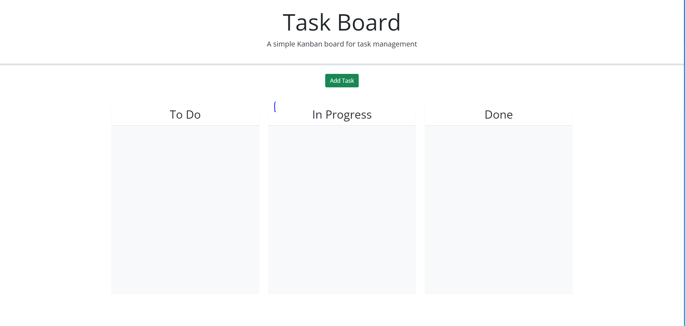
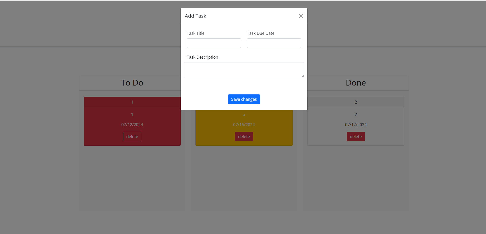
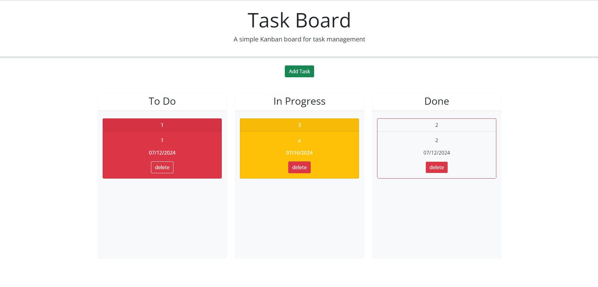

# Prework Study Guide Webpage

## Description
In this web application the user is granted a space to add tasks and move them around depeding on wether they need to be done, they are in progress, or they have been finished. The page saves the users added tasks to local storage to prevent loosing tasks after reloading the page. The order of the tasks, lane location and colors are saved as well. The tasks are color codded: red for overdue, yellow for due within a week, and white for complete or not due for more than a week. If the user moves a task to the Done lane the color will change to white but will change color again if moved to any of the other two lanes.

    home page

    add task

    tasks added

link to github pages: https://alejandrom2023.github.io/M4C_PersonalBlog/

## Installation

N/A

## Usage

By connecting to the page you can see the labeled lanes for task and a add button which allows you to add a task after properly filling out all the fields. You can then drage tasks around to different lanes. All changes are automatically save.

## Credits

N/A

## License

The last section of a high-quality README file is the license. This lets other developers know what they can and cannot do with your project. If you need help choosing a license, refer to [https://choosealicense.com/](https://choosealicense.com/).